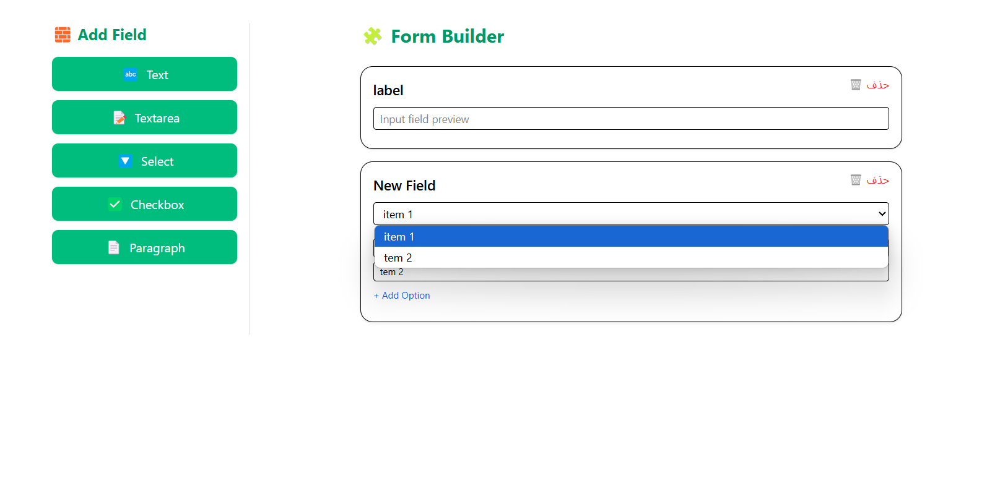

# 🛠 React Form Builder

A modular and extensible form builder built with **React**, **TypeScript**, **TailwindCSS**, and the **Compound Components pattern**.

> Build dynamic, configurable forms with clean architecture, drag-and-drop reordering, and inline field editing.

---

## ✨ Features

- ✅ Add & configure dynamic form fields (text, textarea, select, checkbox, paragraph)
- 🎨 Inline editing of field labels and options
- ↕️ Drag-and-drop reordering using `@hello-pangea/dnd`
- 🧩 Compound Components pattern for modular design
- 🗑 Field removal with one click
- 🧠 Context + Reducer architecture for global form state
- 🎯 Fully typed with TypeScript

---

## 📸 Demo



---

## 🚀 Getting Started

```bash
git clone https://github.com/NooshinBarazi/react-form-builder.git
cd react-form-builder
npm install
npm run dev
